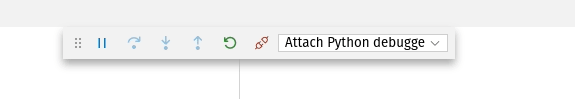

# Daily usage

So, you managed to use this template to generate a subproject. Nice, but... how to use
it now? You'll learn that here.

<details>
<!-- prettier-ignore-start -->
<!-- START doctoc generated TOC please keep comment here to allow auto update -->
<!-- DON'T EDIT THIS SECTION, INSTEAD RE-RUN doctoc TO UPDATE -->
<summary>Table of contents</summary>

- [Prior knowledge](#prior-knowledge)
- [Environments](#environments)
  - [Development](#development)
    - [MailHog](#mailhog)
    - [Network isolation](#network-isolation)
    - [wdb](#wdb)
    - [pgweb](#pgweb)
  - [Production](#production)
    - [Prebuilding images](#prebuilding-images)
    - [Adding secrets](#adding-secrets)
    - [Booting production](#booting-production)
    - [Backups](#backups)
  - [Testing](#testing)
    - [Global whitelist](#global-whitelist)
- [Visual Studio Code Integration](#visual-studio-code-integration)
  - [Debugging Python code](#debugging-python-code)
  - [Debugging JS code](#debugging-js-code)
  - [Debugging Python + JS code 🤯](#debugging-python--js-code-)
- [Other usage scenarios](#other-usage-scenarios)
  - [Inspect the database](#inspect-the-database)
  - [Restart Odoo](#restart-odoo)
  - [Run unit tests for some addon](#run-unit-tests-for-some-addon)
  - [Reading the logs](#reading-the-logs)
  - [Install some addon without stopping current running process](#install-some-addon-without-stopping-current-running-process)
  - [Update some addon without stopping current running process](#update-some-addon-without-stopping-current-running-process)
  - [Update changed addons only](#update-changed-addons-only)
  - [Export some addon's translations to stdout](#export-some-addons-translations-to-stdout)
  - [Open an odoo shell](#open-an-odoo-shell)
  - [Open another UI instance linked to same filestore and database](#open-another-ui-instance-linked-to-same-filestore-and-database)
  - [GeoLite2](#geolite2)

<!-- END doctoc generated TOC please keep comment here to allow auto update -->
<!-- prettier-ignore-end -->
</details>

## Prior knowledge

We try to make it as easy as possible for you, but we don't try to make you stupid. You
should know your toolbox, specifically these tools:

- [copier](https://github.com/pykong/copier)
- [Doodba](https://github.com/Tecnativa/doodba) and the tools it includes
- [Docker Compose](https://docs.docker.com/compose/overview/)
- [Docker Engine](https://www.docker.com/products/docker-engine)
- [Git](https://git-scm.com/)
- [git-aggregator](https://github.com/acsone/git-aggregator)
- [invoke](https://www.pyinvoke.org/)
- [Odoo](https://www.odoo.com/) 😆
- [python](https://www.python.org/)
- [pre-commit](https://pre-commit.com/)
- [click-odoo-contrib][]

Go read their docs and learn them fine.

## Environments

Doodba Copier Template supports these environments, and expects you to use each of them
for what it's for.

### Development

File used: `devel.yaml`. We recommend using [VSCode](https://code.visualstudio.com/) to
develop, and some [special features](#visual-studio-code-integration) for it are
supplied.

Set up a valid VSCode development environment with:

```sh
invoke develop
```

You should see now a `doodba.*.code-workspace` file autogenerated. Open that workspace
with VSCode to load all the features.

Get Odoo and addons code with:

```bash
invoke img-build --pull
invoke git-aggregate
```

Initialize a new empty database with:

```bash
invoke resetdb
```

Start Odoo with:

```bash
invoke start
```

You can also apply some common configurations to help you setup the devel environment
(like setting the `report.url` parameter)::

```bash
invoke preparedb
```

All of the above in one shot:

```bash
invoke develop img-build git-aggregate resetdb start
```

See the other tasks we ship for you with:

```bash
invoke --list
```

To browse Odoo go to `http://localhost:${ODOO_MAJOR}069` (i.e. for Odoo 11.0 this would
be `http://localhost:11069`).

#### MailHog

We use [MailHog](https://github.com/mailhog/MailHog) to provide a fake SMTP server that
intercepts all mail sent by Odoo and displays a simple interface that lets you see and
debug all that mail comfortably, including headers sent, attachments, etc.

- For [development][], it's in `http://localhost:${ODOO_MAJOR}025`
- For [testing][], it's in `http://\$DOMAIN_TEST/smtpfake/`
- For [production][], it's not used.

All environments are configured by default to use the bundled SMTP relay. They are
configured by these environment variables:

- `SMTP_SERVER`
- `SMTP_PORT`
- `SMTP_USER`
- `SMTP_PASSWORD`
- `SMTP_SSL`
- `EMAIL_FROM`

For them to be useful, you need to remove any `ir.mail_server` records in your database.

#### Network isolation

The Docker network is in `--internal` mode, which means that it has no access to the
Internet. This feature protects you in cases where a [production][] database is restored
and Odoo tries to connect to SMTP/IMAP/POP3 servers to send or receive emails. Also when
you are using [connectors](https://github.com/OCA/connector),
[mail trackers](https://www.odoo.com/apps/modules/browse?search=mail_tracking) or any
API sync/calls.

If you still need to have public access, set `internal: false` in the environment file,
detach all containers from that network, remove the network, reatach all containers to
it, and possibly restart them. You can also just do:

```bash
docker compose down
invoke start
```

Usually a better option is
[whitelisting](faq.md#how-can-i-whitelist-a-service-and-allow-external-access-to-it).

#### wdb

[`wdb`](https://github.com/Kozea/wdb/) is one of the greatest Python debugger available,
and even more for Docker-based development, so here you have it preinstalled.

I told you, this image is opinionated. :wink:

To use it, write this in any Python script:

```python
import wdb
wdb.set_trace()
```

It's available by default on the [development][] environment, where you can browse
`http://localhost:${ODOO_MAJOR}984` to use it.

**⚠️ DO NOT USE IT IN PRODUCTION ENVIRONMENTS ⚠️** (I had to say it).

**Note:** Remember that you can instead
[use the integrated debugger in Visual Studio Code](#debugging-python-code)

#### pgweb

[Pgweb](http://sosedoff.github.io/pgweb/) is a small, beautiful and quick tool to
inspect a Postgres database.

We ship it preconfigured in the [development][] environment. Just start it and open
`http://localhost:${ODOO_MAJOR}081` to use it.

### Production

It includes pluggable `smtp` and `backup` services, that will be or not generated
depending on your answers when copying the template.

#### Prebuilding images

We recommend you to use [Gitlab](https://gitlab.com/) to host your subprojects and
prebuild images there, so the same codebase you test is the same you deploy to
production.

#### Adding secrets

To boot this environment, these files must be present:

- `./.docker/odoo.env` must define `ADMIN_PASSWORD`.
- `./.docker/db-access.env` must define `PGPASSWORD`.
- `./.docker/db-creation.env` must define `POSTGRES_PASSWORD` (must be equal to
  `PGPASSWORD` above).
- `./.docker/smtp.env` must define `RELAY_PASSWORD` (password to access the real SMTP
  relay).
- `./.docker/backup.env` must define `AWS_ACCESS_KEY_ID`, `AWS_SECRET_ACCESS_KEY`
  (obtained from S3 provider) and `PASSPHRASE` (to encrypt backup archives).

Copier creates them for you when copying the template, but since they are all
git-ignored (for obvious reasons), you might need to copy them manually when deploying
to production.

#### Booting production

Once secrets are in place and you started the
[global inverse proxy](faq.md#how-to-bootstrap-the-global-inverse-proxy), run the
production environment with:

```bash
docker compose -f prod.yaml up -d
```

#### Backups

Backups are only available in the production environment. They are provided by
[docker-duplicity](https://github.com/Tecnativa/docker-duplicity). The structure of the
backed up folder:

```
├── prod.sql
└── odoo/
    ├── addons/
    └── filestore/
        └── prod/
            ├── ...
            └── ...
```

To make backup immediatly execute following command:

```sh
# Executes all jobs scheduled for daily run.
# With default configuration it's equal to making full backup
docker compose exec backup /etc/periodic/daily/jobrunner
```

To restore backup:

```sh
# stop odoo if it's running
docker compose stop odoo

# start backup and db
docker compose up -d backup

# switch to some version
docker compose exec backup restore --time TIME_IN_BACKUP_NAME --force

# ⚠️ DELETE PRODUCTION database
#docker compose exec backup dropdb

# create new empty database
docker compose exec backup createdb

# restore database
docker compose exec backup sh -c 'psql -f $SRC/$PGDATABASE.sql'

# start odoo
docker compose up -d
```

### Testing

A good rule of thumb is test in testing before uploading to production, so this
environment tries to imitate the [production][] one in everything, but _removing
possible pollution points_:

- It has [a fake `smtp` service based on MailHog](#mailhog), just like development.

- It has no `backup` service.

- It is [isolated](#network-isolation).

To use it, you need to [add secrets files just like for production](#adding-secrets),
although secrets for smtp and backup containers are not needed because those don't exist
here. Also, start
[the global inverse proxy](faq.md#how-to-bootstrap-the-global-inverse-proxy) before
running the test environment.

Test it in your machine with:

```bash
docker compose -f test.yaml up -d
```

#### Global whitelist

Since the testing environment is [network-isolated](#network-isolation), this can change
some deadlocks or big timeouts in code chunks that are not ready for such situation.
Odoo happens to have some of them.

The [development][] environment includes the default recommended whitelist proxies, but
for [testing][], it is recommended to have a separate docker compose project running
along in the same server that provides a `globalwhitelist_default` network where all
whitelist proxies exist. This is a better practice for a testing environment where many
services might coexist, because it will let you save lots of processing power and IP
addresses.

<details>
<summary>Recommended globalwhitelist/docker-compose.yaml file</summary>

```yaml
version: "2.1"

networks:
  public:
    driver_opts:
      encrypted: 1
  shared:
    internal: ${DOODBA_NETWORK_INTERNAL-true}
    driver_opts:
      encrypted: 1

services:
  cdnjs_cloudflare_com:
    image: ghcr.io/tecnativa/docker-whitelist
    restart: unless-stopped
    networks:
      public:
      shared:
        aliases:
          - "cdnjs.cloudflare.com"
    environment:
      TARGET: "cdnjs.cloudflare.com"
      PRE_RESOLVE: 1

  fonts_googleapis_com:
    image: ghcr.io/tecnativa/docker-whitelist
    restart: unless-stopped
    networks:
      public:
      shared:
        aliases:
          - "fonts.googleapis.com"
    environment:
      TARGET: "fonts.googleapis.com"
      PRE_RESOLVE: 1

  fonts_gstatic_com:
    image: ghcr.io/tecnativa/docker-whitelist
    restart: unless-stopped
    networks:
      public:
      shared:
        aliases:
          - "fonts.gstatic.com"
    environment:
      TARGET: "fonts.gstatic.com"
      PRE_RESOLVE: 1

  www_google_com:
    image: ghcr.io/tecnativa/docker-whitelist
    restart: unless-stopped
    networks:
      public:
      shared:
        aliases:
          - "www.google.com"
    environment:
      TARGET: "www.google.com"
      PRE_RESOLVE: 1

  www_gravatar_com:
    image: ghcr.io/tecnativa/docker-whitelist
    restart: unless-stopped
    networks:
      public:
      shared:
        aliases:
          - "www.gravatar.com"
    environment:
      TARGET: "www.gravatar.com"
      PRE_RESOLVE: 1
```

</details>

## Visual Studio Code Integration

Generated projects have out-of-the-box integration with
[Visual Studio Code](https://code.visualstudio.com/) to provide you with a better and
easier-to-use experience through:

- Suggested extensions
- Launch configurations
- Workspace definition
- Integration with invoke
- Debugger integration

**Note**: As the configurations are defined per project and depending on the Odoo addons
you are working on, you might need to update your configuration frequently with
`invoke write-code-workspace-file` (done automatically when you invoke other tasks).

### Debugging Python code

In order to debug Python code, you need to:

1. Install suggested extensions, as mentioned above
1. Run `invoke develop`
1. Go to the "Run" tab in VSCode, select "Start Odoo and debug Python", and click "Run".
   The program will stop in any breakpoint you have and you will be able to analyze your
   Python environment.

### Debugging JS code

In order to debug JavaScript code, you need to:

1. Install suggested extensions, as mentioned above
1. Run `invoke develop`
1. Go to the "Run" tab in VSCode, select "Start Odoo and debug JS in [Firefox/Chrome]",
   and click "Run". The program will stop in any breakpoint you have and you will be
   able to analyze your JS environment.

If you face some problems while debugging in Firefox or Chrome, see our [FAQ](faq.md) or
the corresponding extensions documentation before opening an issue here.

### Debugging Python + JS code 🤯

In order to debug Python and JavaScript code at the same time, you need to:

1. Install suggested extensions, as mentioned above
1. Go to the "Run" tab in VSCode, select "Start Odoo and debug Python + JS in
   [Firefox/Chrome]", and click "Run". The program will stop in any breakpoint you have
   and you will be able to analyze your Python and JS environment. You will just need to
   switch between both environments running at the same time in the VSCode debugger.

   

## Other usage scenarios

In examples below I will skip the `-f <environment>.yaml` part and assume you know which
environment you want to use.

Also, we recommend to use `run` subcommand to create a new container with same settings
and volumes. Sometimes you may prefer to use `exec` instead, to execute an arbitrary
command in a running container.

### Inspect the database

```bash
docker compose run --rm odoo psql
```

### Restart Odoo

You will need to restart it whenever any Python code changes, so to do that:

```bash
docker compose restart odoo
```

In development mode odoo restarts by itself thanks to `--dev=reload` option.

### Run unit tests for some addon

```bash
modules=addon1,addon2
# Install their dependencies first
docker compose run --rm odoo addons init --dependencies --with $modules
# Test them at install
docker compose run --rm odoo addons init --test --with $modules
# Test them again at update
docker compose run --rm odoo addons update --test --with $modules
```

\* Note: This replaces the old deprecated `unittest` script.

### Reading the logs

For all services in the environment:

```bash
docker compose logs -f --tail 10
```

Only Odoo's:

```bash
docker compose logs -f --tail 10 odoo
```

### Install some addon without stopping current running process

```bash
docker compose run --rm odoo odoo -i addon1,addon2 --stop-after-init
```

### Update some addon without stopping current running process

```bash
docker compose run --rm odoo odoo -u addon1,addon2 --stop-after-init
```

### Update changed addons only

Just run:

```bash
docker compose run --rm odoo click-odoo-update --watcher-max-seconds 30
```

This script is part of [click-odoo-contrib][]; check it for more details.

\* Note: `--watcher-max-seconds` is available because we ship a
[patched](https://github.com/acsone/click-odoo-contrib/pull/38) version. Check that PR
for docs.

\* Note: This replaces the old deprecated `autoupdate` script.

### Export some addon's translations to stdout

```bash
docker compose run --rm odoo pot addon1[,addon2]
```

Now copy the relevant parts to your `addon1.pot` file.

### Open an odoo shell

```bash
docker compose run --rm odoo odoo shell
```

### Open another UI instance linked to same filestore and database

```bash
docker compose run --rm -p 127.0.0.1:$SomeFreePort:8069 odoo
```

Then open `http://localhost:$SomeFreePort`.

### GeoLite2

To enable geoip support for Odoo you need to signup for a Maxmind account for GeoLite2:
https://www.maxmind.com/en/geolite2/signup

Create a license key in your maxmind account and provide your account id and license key
on build to the scaffolding.

The `GEOIP_ACCOUNT_ID` environment variable should hold the account id and
`GEOIP_LICENSE_KEY` the license key. Both are visible on the "My License Key" page under
your [account](https://www.maxmind.com/en/account) when you create the license key.

Example config (docker-compose.yml)

```yaml
services:
  odoo:
    environment:
      ...
      # This product includes GeoLite2 data created by MaxMind, available from https://www.maxmind.com
      GEOIP_ACCOUNT_ID: 1234
      GEOIP_LICENSE_KEY: aBcDeF
  ...
```

When building you should see a message `Activating GeoIP/GeoLite2 updates`.

Upon (re)start the container will perform the updates as requested by the
[eula](https://www.maxmind.com/en/geolite2/eula). You also can update the database by
calling `geoipupdate` inside the running container.

When you run geoip in an isolated environment (odoo is only able to access whitelisted
addresses) make sure odoo is able to access `updates.maxmind.com`. You could do so by
adding the whitelist proxy like this to your docker-compose.yml:

```yaml
  odoo:
    ...
    depends_on:
      ...
      - maxmind_proxy
      ...
    ...
  ...

  maxmind_proxy:
    image: ghcr.io/tecnativa/docker-whitelist
    networks:
      default:
        aliases:
          - updates.maxmind.com
      public:
    environment:
      TARGET: updates.maxmind.com
      PRE_RESOLVE: 1
  ...

```

[development]: #development
[testing]: #testing
[production]: #production
[click-odoo-contrib]: https://github.com/acsone/click-odoo-contrib
